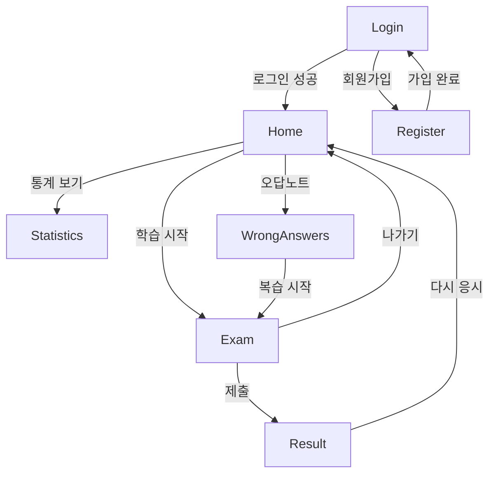

# 📑 전기기능사 CBT - 페이지 분석 요약

**최초 분석:** 2025-12-02 20:52:57 (KST)  
**최종 업데이트:** 2025-12-03 06:51:00 (KST)  
**프로젝트:** 전기기능사 CBT 시스템

---

## 📊 전체 페이지 개요

| 페이지 | 파일 | 줄 수 | 역할 |
|---|---|---|---|
| **관리자** | Admin.tsx | 4,576 | 문제/회원 관리, 동기화, 통계 |
| **시험** | Exam.tsx | 2,261 | 문제 풀이, 타이머, 학습 진도 |
| **홈** | Home.tsx | 775 | 모드 선택, 문제 로드 |
| **결과** | Result.tsx | 399 | 시험 결과, 해설 |
| **오답노트** | WrongAnswers.tsx | 376 | 오답 관리, 복습 |
| **로그인** | Login.tsx | 316 | 인증, 데이터 동기화 |
| **회원가입** | Register.tsx | 271 | 신규 회원 등록 |
| **통계** | Statistics.tsx | 270 | 학습 통계 시각화 |

**총 줄 수:** 9,244줄

---

## 🔄 페이지 흐름



---

## 🎯 주요 기능 매트릭스

| 기능 | Login | Home | Exam | Result | WrongAnswers | Statistics | Register | Admin |
|---|:---:|:---:|:---:|:---:|:---:|:---:|:---:|:---:|
| **데이터 동기화** | ✅ | ✅ | ✅ | | | | ✅ | ✅ |
| **문제 로드** | | ✅ | ✅ | ✅ | ✅ | | | ✅ |
| **답변 저장** | | | ✅ | | | | | |
| **타이머** | | | ✅ | ✅ | | | | |
| **오답 관리** | | | ✅ | | ✅ | | | |
| **통계** | | ✅ | | ✅ | | ✅ | | ✅ |
| **세션 관리** | ✅ | ✅ | ✅ | | | | | |
| **가중치 출제** | | ✅ | | | | | | ✅ |

---

## 💾 데이터 저장소 활용

### LocalStorage
- ✅ Login: 회원 목록, 사용자 ID
- ✅ Home: 세션 데이터
- ✅ Exam: 답변, 학습 진도
- ✅ WrongAnswers: 오답 목록
- ✅ Statistics: 통계 데이터

### Supabase
- ✅ Login: 회원 동기화, 학습 데이터
- ✅ Home: 문제 로드
- ✅ Exam: 사용자 데이터 동기화
- ✅ Admin: 문제/회원 CRUD

---

## 🔑 핵심 State 관리

### 공통 State
```typescript
currentUser: number | null      // 현재 사용자 ID
questions: Question[]           // 문제 목록
examMode: ExamMode             // 시험 모드
```

### 페이지별 State

#### Exam
```typescript
answers: { [id: number]: number }         // 답변
learningProgress: { [id: number]: number } // 학습 진도
currentIndex: number                       // 현재 문제 인덱스
remainingTime: number                      // 남은 시간
```

#### Home
```typescript
learningMode: LearningMode                 // 학습 모드
selectedCategory: string                   // 선택 카테고리
hasPreviousSession: boolean                // 이전 세션 여부
```

#### Admin
```typescript
activeTab: string                          // 현재 탭
questions: Question[]                      // 문제 목록
members: Member[]                          // 회원 목록
selectedQuestions: Set<number>             // 선택된 문제
```

---

## 🎨 공통 UI 패턴

### 모달
- ✅ Exam: 채점 결과, 인쇄 옵션
- ✅ Admin: 문제 추가/수정, 미리보기
- ✅ WrongAnswers: 문제 상세

### 버튼 상태
```typescript
<button
  disabled={loading}
  className={loading 
    ? 'bg-gray-400 cursor-not-allowed' 
    : 'bg-blue-600 hover:bg-blue-700'
  }
>
  {loading ? '처리 중...' : '실행'}
</button>
```

### 에러 처리
```typescript
{error && (
  <div className="bg-red-50 border-l-4 border-red-500">
    <p className="text-red-800">{error}</p>
  </div>
)}
```

---

## 🚀 성능 최적화

### 1. 페이지네이션 (Admin)
- 100개씩 표시

### 2. Lazy Loading
- 문제 이미지 지연 로드

### 3. 캐싱
- Supabase 데이터 → LocalStorage 캐싱

### 4. 자동 저장
- Exam: useEffect로 답변 자동 저장

---

## 🔐 보안 고려사항

### 현재 구현
- ⚠️ Admin: 하드코딩된 비밀번호
- ✅ Login: 비밀번호 없는 간편 인증
- ✅ 세션: 사용자별 분리

### 개선 권장
- 🔐 JWT 토큰 사용
- 🔐 Supabase Auth 사용
- 🔐 환경 변수로 비밀번호 관리

---

## 📝 문서 위치

```
d:\cbt\electrical-cbt\분석\
├── 관리자분석.md             (4,576줄 분석)
├── 시험분석.md               (2,261줄 분석)
├── 홈분석.md                (775줄 분석)
├── 결과분석.md              (399줄 분석)
├── 오답노트분석.md          (376줄 분석)
├── 로그인분석.md            (316줄 분석)
├── 회원가입분석.md          (271줄 분석)
├── 통계분석.md              (270줄 분석)
├── UI_개선_계획서_헤더레이아웃.md
├── 인쇄기능_개선내역.md     ← 2025-12-03 추가
└── 📑 README.md             (이 파일)
```

---

**분석 완료 일시:** 2025-12-02 20:52:57 (KST)  
**총 분석 페이지:** 8개 (9,244줄)  
**문서 생성:** 9개 파일
