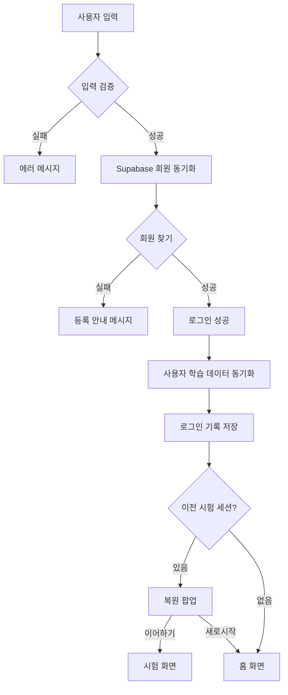

# 🔑 로그인 페이지 분석

**분석 일시:** 2025-12-02 20:52:57 (KST)  
**분석 대상:** `src/pages/Login.tsx` (316줄)  
**페이지 역할:** 사용자 인증 및 데이터 동기화

---

## 📋 개요

로그인 페이지는 사용자 인증과 동시에 여러 데이터 소스를 동기화하는 **데이터 게이트웨이** 역할을 합니다.

---

## 🔑 주요 기능

### 1. 유연한 로그인 시스템

```typescript
// 3가지 방식 중 하나로 로그인 가능
const member = getMemberByAnyCredential(input);

로그인 방법:
- 이름 (예: "홍길동")
- 전화번호 (예: "010-1234-5678")
- 이메일 (예: "example@email.com")
```

**특징:**
- ✅ 비밀번호 없음 (간편 로그인)
- ✅ 하나의 정보만으로 인증
- ✅ 자동 trim() 처리

### 2. 3중 데이터 동기화

#### A. 회원 목록 동기화

```typescript
syncMembersFromSupabase()
// 1. Supabase에서 전체 회원 목록 가져오기
// 2. Supabase를 source of truth로 사용
// 3. LocalStorage 업데이트
// 4. 삭제된 회원 자동 제거
```

**프로세스:**
```
Supabase (최신) → LocalStorage (캐시)
- 서버에만 있는 회원: 추가
- 서버에 없는 회원: 삭제
- 중복 방지: ID 기준 병합
```

#### B. 사용자 학습 데이터 동기화

```typescript
syncUserDataFromSupabase(userId)
// 1. 오답 노트 병합
// 2. 시험 결과 병합
// 3. 통계 데이터 동기화
```

**병합 로직:**
```typescript
// 오답 노트
const mergedWrongAnswers = [...serverWrongAnswers];
for (const localWA of localWrongAnswers) {
  if (!existsInServer) {
    mergedWrongAnswers.push(localWA); // 새로운 오답 추가
  }
}

// 시험 결과
const mergedResults = [...serverExamResults];
// 로컬에만 있는 결과 추가
// 최신순 정렬 후 최근 100개만 유지
mergedResults.sort((a, b) => b.timestamp - a.timestamp);
saveExamResults(mergedResults.slice(0, 100));

// 통계
saveStatistics(serverData.statistics); // 서버 우선
```

### 3. 로그인 기록 저장

```typescript
// 이중 저장
addLoginHistory(member.id, member.name);        // LocalStorage
await saveLoginHistory(member.id, member.name); // Supabase
```

**데이터 구조:**
```typescript
{
  id: number,
  userId: number,
  userName: string,
  timestamp: number,
  device: string,      // PC/스마트폰/태블릿
  userAgent?: string
}
```

### 4. 이전 시험 복원

```typescript
// 현재 사용자의 세션만 복원
const currentSession = getCurrentExamSession();

if (currentSession && currentSession.userId === member.id) {
  // "이전에 풀던 시험이 있습니다!" 팝업
  // ✅ 확인: 이전 시험 이어서 풀기
  // ❌ 취소: 새로운 시험 시작
}

// 다른 사용자의 세션이면 삭제
if (currentSession && currentSession.userId !== member.id) {
  clearCurrentExamSession();
}
```

---

## 🔄 로그인 프로세스



---

## 📊 State 관리

```typescript
const [input, setInput] = useState('');           // 사용자 입력
const [error, setError] = useState<string | null>(null);  // 에러 메시지
const [loading, setLoading] = useState(false);    // 로딩 상태
```

---

## 🎨 UI/UX

### 입력 필드

```typescript
<input
  type="text"
  placeholder="홍길동 또는 010-1234-5678 또는 example@email.com"
  autoFocus
  onKeyPress={e => e.key === 'Enter' && handleLogin()}
/>
```

**힌트 메시지:**
```
💡 이름, 전화번호, 이메일 주소 중 하나만 입력하세요.
```

### 에러 표시

```typescript
{error && (
  <div className="bg-red-50 border-l-4 border-red-500">
    <p className="text-red-800 whitespace-pre-line">{error}</p>
  </div>
)}
```

### 버튼 상태

```typescript
<button
  disabled={loading}
  className={loading ? 'bg-blue-400 cursor-not-allowed' : 'bg-blue-600 hover:bg-blue-700'}
>
  {loading ? '로그인 중...' : '🔑 로그인'}
</button>
```

---

## 🔐 초기화 및 동기화

### 페이지 로드 시

```typescript
useEffect(() => {
  initializeData();                  // 기본 데이터 초기화
  syncMembersFromSupabase();        // 회원 목록 동기화
}, []);
```

### 로그인 시

```typescript
1. Supabase에서 최신 회원 정보 동기화
2. 회원 찾기 (이름/전화번호/이메일)
3. 로그인 성공 → 사용자 설정
4. 사용자 학습 데이터 동기화
5. 로그인 기록 저장 (LocalStorage + Supabase)
6. 이전 시험 세션 확인
7. 홈 화면 또는 시험 화면 이동
```

---

## 🎯 에러 처리

### 1. 입력값 없음

```typescript
if (!input.trim()) {
  setError('이름, 전화번호 또는 이메일 주소를 입력하세요.');
  return;
}
```

### 2. 회원 없음

```typescript
if (!member) {
  if (allMembers.length === 0) {
    setError('등록된 회원이 없습니다. 회원가입을 먼저 해주세요.');
  } else {
    setError(`등록되지 않은 사용자입니다.\n\n입력한 값: "${trimmedInput}"\n\n※ 이름, 전화번호 또는 이메일 주소 중 하나를 정확히 입력하세요.\n※ 회원가입이 필요하시면 아래 '회원가입' 버튼을 눌러주세요.`);
  }
  return;
}
```

### 3. 동기화 실패

```typescript
// Supabase 동기화 실패해도 로그인은 진행
try {
  await syncMembersFromSupabase();
} catch (err) {
  console.warn('⚠️ Supabase 회원 동기화 실패:', err);
  // 로그인 계속 진행
}

// 로그인 기록 저장 실패해도 로그인은 진행
try {
  await saveLoginHistory(member.id, member.name);
} catch (err) {
  console.warn('⚠️ Supabase 로그인 기록 저장 오류:', err);
  // 로그인 계속 진행
}
```

---

## 🚀 성능 최적화

### 1. 회원 목록 병합

```typescript
// Supabase를 source of truth로 사용
const mergedMembers = supabaseMembers.map(sMember => ({
  id: sMember.id,
  name: sMember.name,
  phone: sMember.phone,
  email: sMember.email,
  address: sMember.address,
  registeredAt: sMember.registeredAt,
  memo: sMember.memo || ''
}));

// 로컬에만 있는 회원 자동 제거
const removedMembers = localMembers.filter(m => !supabaseIds.has(m.id));
```

### 2. 학습 데이터 병합

```typescript
// 오답 노트: 서버 우선, 로컬 추가
const mergedWrongAnswers = [...serverWrongAnswers];
for (const localWA of localWrongAnswers) {
  if (!existsInServer) {
    mergedWrongAnswers.push(localWA);
  }
}

// 시험 결과: 최신 100개만 유지
mergedResults.sort((a, b) => b.timestamp - a.timestamp);
saveExamResults(mergedResults.slice(0, 100));
```

---

## 💡 핵심 특징

### 1. 간편한 인증

- ✅ 비밀번호 없음
- ✅ 이름/전화번호/이메일 중 하나만
- ✅ 엔터키 지원

### 2. 데이터 동기화

- ✅ Supabase ↔ LocalStorage 양방향
- ✅ 서버 우선 병합
- ✅ 실패해도 로그인 진행

### 3. 세션 관리

- ✅ 사용자별 세션 분리
- ✅ 이전 시험 복원 옵션
- ✅ 다른 사용자 세션 자동 삭제

### 4. 오프라인 지원

- ✅ LocalStorage 캐싱
- ✅ Supabase 실패 시 fallback
- ✅ 로그인 기록 이중 저장

---

## 🔗 연결된 페이지

```typescript
interface LoginProps {
  onLoginSuccess: () => void;      // 로그인 성공 → Home
  onResumeExam?: () => void;       // 이전 시험 복원 → Exam
  onGoToRegister?: () => void;     // 회원가입 → Register
}
```

---

## 📝 로그 출력

```typescript
// 로그인 시도
console.log('🔍 로그인 시도:', { input: trimmedInput });

// 로그인 성공
console.log('✅ 로그인 성공:', member.name, '(ID:', member.id + ')');

// 회원 동기화
console.log(`✅ 회원 목록 동기화 완료: ${supabaseMembers.length}명 (서버 기준)`);

// 학습 데이터 동기화
console.log(`✅ 사용자 학습 데이터 동기화 완료: 오답 ${mergedWrongAnswers.length}개, 시험 ${mergedResults.length}개`);
```

---

**분석 완료 일시:** 2025-12-02 20:52:57 (KST)
