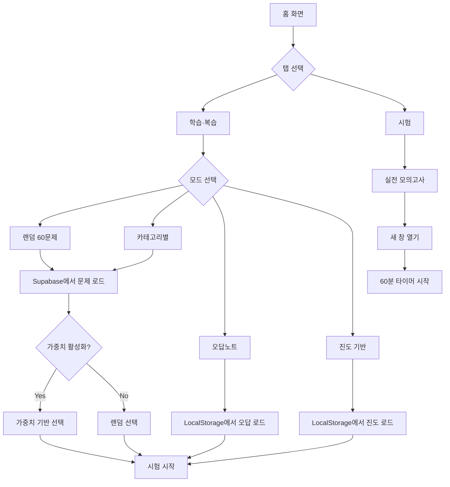

# 🏠 홈 페이지 분석

**분석 일시:** 2025-12-02 20:52:57 (KST)  
**분석 대상:** `src/pages/Home.tsx` (775줄)  
**페이지 역할:** 시험 모드 선택 및 문제 로드

---

## 📋 개요

홈 페이지는 사용자가 학습 모드를 선택하고 시험을 시작하는 **메인 허브**입니다.

---

## 🎯 2가지 주요 탭

### 1️⃣ 학습·복습 탭

#### 📚 4가지 학습 모드

| 모드 | 설명 | 문제 수 | 시간 제한 |
|---|---|---|---|
| **🎲 랜덤 60문제** | 전체 카테고리에서 무작위 선택 | 60문제 | ❌ 없음 |
| **📚 카테고리별** | 특정 카테고리 집중 학습 | 20문제 | ❌ 없음 |
| **📝 오답노트** | 틀렸던 문제만 재출제 | 최대 20문제 | ❌ 없음 |
| **📊 진도 기반 복습** | 학습 진도 1-5 문제 복습 | 최대 60문제 | ❌ 없음 |

### 2️⃣ 시험 탭

| 모드 | 설명 | 문제 수 | 시간 제한 |
|---|---|---|---|
| **🎯 실전 모의고사** | 실제 시험과 동일한 환경 | 60문제 (각 20문제씩) | ✅ 60분 |

---

## 🔧 가중치 기반 출제 시스템

### 설정 확인

```typescript
const examConfig = getExamConfig();

if (examConfig.weightBasedEnabled) {
  console.log('🎯 가중치 기반 출제 활성화');
  console.log(`선택된 가중치: ${examConfig.selectedWeights.join(', ')}`);
  
  // 가중치 필터링
  examQuestions = selectBalancedQuestionsByWeight(
    allQuestions,
    60,
    examConfig
  );
} else {
  // 일반 랜덤 선택
  examQuestions = await fetchRandom60Questions();
}
```

### 가중치 시스템

```
가중치 1  = 최고 빈도 (쉬운 문제)
가중치 5  = 중간 빈도
가중치 10 = 최저 빈도 (어려운 문제)
```

---

## 📊 문제 현황 표시

### 실시간 통계

```typescript
const loadQuestionCounts = async () => {
  // Supabase에서 직접 COUNT 쿼리
  const counts = await getCategoryCounts();
  
  setQuestionCounts({
    전기이론: counts.전기이론,
    전기기기: counts.전기기기,
    전기설비: counts.전기설비,
    total: counts.total,
  });
};
```

**UI 표시:**
```
📊 문제 현황
┌─────────────┐
│   5012개    │  전체 문제
│   1670개    │  전기이론
│   1671개    │  전기기기
│   1671개    │  전기설비
└─────────────┘
```

### 자동 업데이트

```typescript
// 페이지 포커스 시 자동 갱신
window.addEventListener('focus', () => {
  loadQuestionCounts();
});
```

---

## 🎲 랜덤 60문제 모드

### 프로세스

```typescript
handleStartLearning() {
  // 1. 이전 세션 삭제
  clearCurrentExamSession();
  
  // 2. 가중치 기반 선택
  if (examConfig.weightBasedEnabled) {
    const allQuestions = await fetchAllQuestions();
    examQuestions = selectBalancedQuestionsByWeight(
      allQuestions,
      60,
      examConfig
    );
  } else {
    examQuestions = await fetchRandom60Questions();
  }
  
  // 3. 세션 저장
  const sessionData: ExamSession = {
    questions: examQuestions,
    answers: {},
    startTime: Date.now(),
    mode: 'untimedRandom',
    userId: currentUserId,
  };
  saveCurrentExamSession(sessionData);
  
  // 4. 시험 시작
  onStartExam(examQuestions, 'untimedRandom');
}
```

---

## 📚 카테고리별 학습

### 선택 옵션

```typescript
<select value={selectedCategory} onChange={...}>
  <option value="전기이론">전기이론</option>
  <option value="전기기기">전기기기</option>
  <option value="전기설비">전기설비</option>
</select>
```

### 가중치 필터링

```typescript
if (examConfig.weightBasedEnabled) {
  examQuestions = selectCategoryQuestionsByWeight(
    allQuestions,
    selectedCategory,
    20,
    examConfig
  );
} else {
  examQuestions = await fetchRandomQuestions(selectedCategory, 20);
}
```

---

## 📝 오답노트 복습

### 조건

```typescript
const wrongAnswers = getWrongAnswers();
const eligibleWrong = wrongAnswers.filter(wa => wa.correctStreak < 3);
// → 연속 3회 정답 미만인 문제만
```

### 문제 선택

```typescript
let wrongQuestions = eligibleWrong.map(wa => wa.question);

if (wrongQuestions.length > 20) {
  // 20개로 제한 (랜덤 셔플)
  const shuffled = [...wrongQuestions].sort(() => Math.random() - 0.5);
  wrongQuestions = shuffled.slice(0, 20);
}
```

---

## 📊 진도 기반 복습

### 복습 대상

```typescript
examQuestions = getReviewQuestions();
// → 학습 진도 1-5 (완벽이해 6 제외)
```

---

## 🎯 실전 모의고사

### 특징

```typescript
📋 구성: 전기이론 20 + 전기기기 20 + 전기설비 20
⏱️ 시간: 60분 타이머
🪟 실행: 새 창에서 시험 진행
🔒 세션: 저장하지 않음 (이전 시험 복원 불가)
```

### 새 창 열기

```typescript
handleStartExam() {
  // 가중치 기반 또는 랜덤 선택
  const examQuestions = selectBalancedQuestionsByWeight(...);
  
  // 세션 저장
  saveCurrentExamSession({
    questions: examQuestions,
    mode: 'timedRandom',
    ...
  });
  
  // 새 창 열기
  const width = 1400;
  const height = 900;
  const left = (window.screen.width - width) / 2;
  const top = 100;
  
  window.open(
    `${window.location.origin}?mode=exam`,
    '_blank',
    `width=${width},height=${height},left=${left},top=${top}`
  );
}
```

---

## 📖 이전 세션 복원

### 조건

```typescript
// 실전 모의고사는 세션 복원 안함
if (existingSession && existingSession.mode !== 'timedRandom') {
  setHasPreviousSession(true);
  setPreviousSession(existingSession);
}
```

### UI 표시

```typescript
{hasPreviousSession && (
  <div className="bg-yellow-50 border border-yellow-200">
    <p>📖 이전에 진행하던 {getModeLabel(mode)} 세션이 있습니다</p>
    <span>({answeredCount}/{totalCount} 완료)</span>
    <button onClick={handleResumePreviousExam}>
      📖 이전 세션 이어하기
    </button>
  </div>
)}
```

---

## 🔄 데이터 흐름



---

## 🎨 UI/UX

### 탭 전환

```typescript
<div className="flex bg-gray-100 rounded-lg p-1">
  <button
    className={activeTab === 'learning' 
      ? 'bg-blue-600 text-white' 
      : 'text-gray-600'
    }
  >
    📚 학습·복습
  </button>
  <button
    className={activeTab === 'exam' 
      ? 'bg-red-600 text-white' 
      : 'text-gray-600'
    }
  >
    🎯 시험
  </button>
</div>
```

### 라디오 버튼

```typescript
<label className={
  learningMode === 'untimedRandom' 
    ? 'border-green-500 bg-green-50' 
    : 'border-gray-200'
}>
  <input
    type="radio"
    value="untimedRandom"
    checked={learningMode === 'untimedRandom'}
  />
  <div>🎲 랜덤 60문제</div>
  <div>시간 제한 없이 자유롭게 학습</div>
</label>
```

---

## ⚙️ 햄버거 메뉴

### 메뉴 항목

```typescript
<div className="dropdown-menu">
  <button onClick={onGoToStatistics}>📊 학습 통계</button>
  <button onClick={handleClearAllData}>🗑️ 데이터 초기화</button>
  <hr />
  <button onClick={handleLogout}>🚪 로그아웃</button>
</div>
```

### 데이터 초기화

```typescript
handleClearAllData() {
  const wrongCount = getWrongAnswers().length;
  
  const message = 
    '모든 데이터를 초기화하시겠습니까?\n\n' +
    `- 오답 노트: ${wrongCount}문제\n` +
    '- 진행 중인 시험 세션\n' +
    '- 학습 통계\n' +
    '- 문제 이해도\n\n' +
    '⚠️ 이 작업은 되돌릴 수 없습니다.';
  
  if (confirm(message)) {
    clearAllData();
    window.location.reload();
  }
}
```

---

## 📊 로그 출력

```typescript
// 가중치 기반 선택
console.log('🎯 가중치 기반 출제 모드 활성화');
console.log(`📋 모드: ${examConfig.mode}, 선택된 가중치: ${examConfig.selectedWeights.join(', ')}`);
console.log(`✅ 가중치 기반 선택 완료: ${examQuestions.length}개`);

// 문제 분포
console.log('📊 선택된 문제 가중치 분포:', weightDist);
console.log('📊 선택된 문제 카테고리 분포:', categoryDist);

// 문제 현황
console.log(`📊 문제 현황 (서버): 전기이론 ${counts.전기이론}개, 전기기기 ${counts.전기기기}개, 전기설비 ${counts.전기설비}개 (총 ${counts.total}개)`);
```

---

## 💡 핵심 특징

### 1. 유연한 학습 모드

- ✅ 4가지 학습 모드
- ✅ 1가지 시험 모드
- ✅ 모드별 최적화

### 2. 가중치 기반 출제

- ✅ 난이도 조절
- ✅ 선택적 활성화
- ✅ 실시간 로그

### 3. 세션 관리

- ✅ 이전 세션 복원
- ✅ 모드별 세션 처리
- ✅ 자동 저장

### 4. 실시간 통계

- ✅ 문제 수 표시
- ✅ 자동 갱신
- ✅ Fallback 지원

---

**분석 완료 일시:** 2025-12-02 20:52:57 (KST)

---

## ✅ 2025-12-03 개선 사항 적용 (P0 + P1)

### 1. 📊 통계 카드 UI 개선
- **기존:** 2x2 또는 4x1 그리드로 모든 정보가 동등하게 표시됨
- **변경:** **1 Large + 3 Small** 레이아웃 적용
  - **전체 문제:** 상단에 크게 배치하여 강조 (가독성 향상)
  - **카테고리별:** 하단에 3열 그리드로 배치

### 2. 🎨 학습 모드 카드 디자인
- **터치 영역 확대:** 패딩을 `p-3` → `p-5`로 확대하고 `rounded-2xl` 적용
- **가독성 강화:**
  - 제목: `font-semibold` → `font-bold`, `text-base` → `text-lg`
  - 설명: `text-xs` → `text-sm`, 텍스트 길이 축약 (2줄 → 1줄)
- **시각적 피드백:** 선택 시 테두리 색상 및 배경색 강조 강화

### 3. ⭐ 추천 배지 및 기능 추가
- **랜덤 60문제:** "⭐ 추천" 배지 추가 (Pulse 애니메이션 효과)
- **오답노트:** 빈 상태 처리 추가 (0문제일 경우 "현재 틀린 문제가 없습니다" 표시)
- **카테고리 선택:** 드롭다운 애니메이션 추가 및 스타일 개선

### 4. 📱 반응형 및 접근성
- 모바일 환경에서도 터치하기 쉽도록 타겟 크기 최적화
- 폰트 크기 전반적 상향 조정으로 가독성 개선

### 5. 🎴 파이널 학습 (카드 암기) 모드 추가
- **기능:** 핵심 요약 카드를 통한 암기 학습 모드 (`FinalStudy` 페이지 연결)
- **UI:** Teal 색상 테마의 카드형 라디오 버튼 추가
- **진입:** 학습 모드 리스트 최하단에 배치, 선택 후 "학습 시작" 클릭 시 이동

